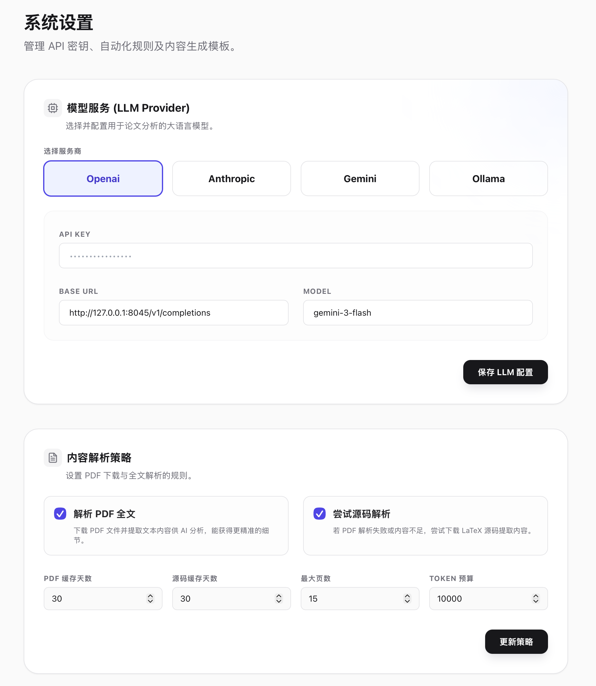
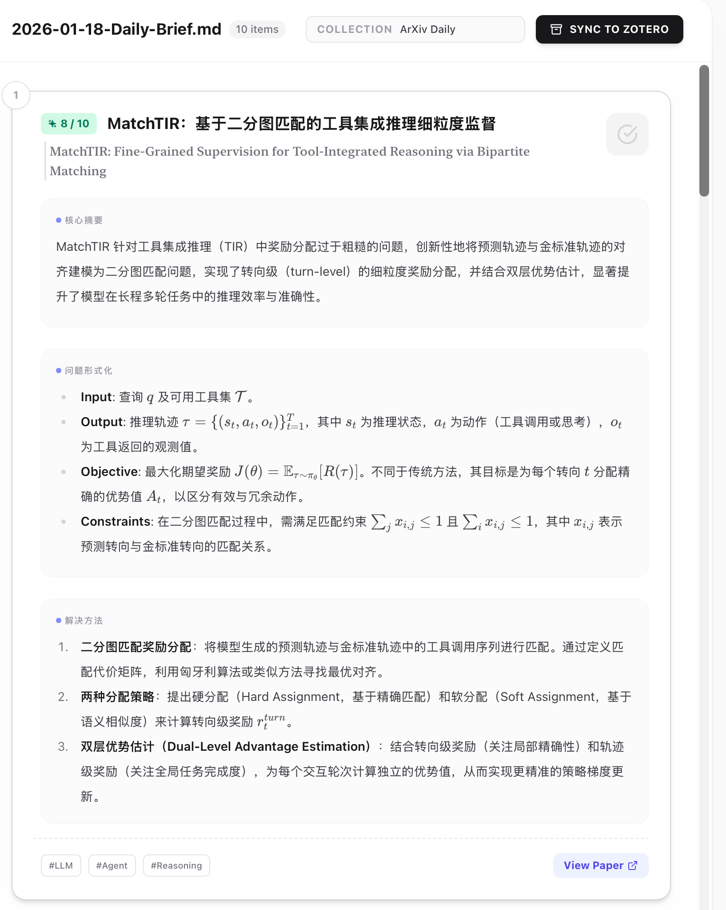

# 📑 学术简报与知识流转系统 (Academic Briefing System)

<div align="center">

[](https://opensource.org/licenses/MIT)
[](https://www.python.org/)
[](https://nodejs.org/)
[](https://fastapi.tiangolo.com/)
[](https://reactjs.org/)

[**English Documentation**](README.md) | [提交 Bug](https://github.com/yourusername/daily-report/issues) | [功能建议](https://github.com/yourusername/daily-report/issues)

</div>

---

**学术简报与知识流转系统** 是一个端到端的自动化流水线，旨在帮助研究人员高效获取知识。它能自动抓取最新的 arXiv 论文，利用先进的 LLM 进行深度分析，并将精选内容无缝沉淀为个人知识库（PDF + 笔记 + Zotero 条目）。

## ✨ 主要功能

- **🔍 智能抓取**：根据自定义关键词查询，自动获取最新的 arXiv 论文。
- **🧹 智能去重**：通过本地历史记录过滤，确保内容不重复。
- **🤖 AI 深度分析**：利用 LLM 生成结构化、有洞察力的每日简报。
- **✅ 精选归档**：在简报中审阅并简单勾选，即可将论文加入永久收藏。
- **🔗 无缝同步**：自动同步条目到 Zotero，下载 PDF 文件，并生成 Astro 笔记存根。
- **🔗 源码解析**：支持下载 ArXiv LaTeX 源码并解析，获取更精准的全文内容。
- **🖥️ 全栈交互**：内置强大的 FastAPI 后端与现代化的 Vite/React 前端界面，支持可视化调度。


## 🚀 快速使用指南

以下步骤将帮助你从零开始部署并使用本系统。

### 1. 环境准备
推荐使用 Conda 创建独立的虚拟环境：
```bash
conda create -n daily_report python=3.10
conda activate daily_report
```

### 2. 安装核心依赖
下载 Python 后端所需的库：
```bash
pip install -r requirements.txt
```

### 3. 安装前端依赖
进入 UI 目录并安装 Node.js 依赖：
```bash
cd ui
npm install
cd ..
cp .env.example .env
```

### 4. 启动服务
在项目根目录下运行启动脚本，将同时启动后端 API 和前端网页：
```bash
python app.py
```
> 服务启动后，浏览器自动访问或手动打开: `http://localhost:3000`

### 5. 填写配置
进入「偏好设置」页面，填写你的 LLM API Key（如 OpenAI、Gemini 等）以及 Zotero 配置。



### 6. 开始分析
回到「情报抓取」页面，输入你感兴趣的论文关键词（如 `LLM`, `Agent`），点击**开始抓取任务**。系统将自动搜索、下载并进行 AI 分析。

### 7. 归档到 Zotero
分析完成后，进入「简报阅读室」。阅读生成的简报，勾选你认为有价值的论文，点击顶部的 **Sync to Zotero** 按钮。系统将自动把论文元数据、PDF 及笔记同步到你的 Zotero 库中。



---

## ⚙️ 进阶配置说明

系统所有配置均通过环境变量管理（自动加载 `.env`），也可在前端界面修改。

### 🧠 LLM 提供商配置
设置 `LLM_PROVIDER` 为以下之一：`openai`, `anthropic`, `gemini`, `ollama`。

| 提供商 (Provider) | 必需变量 |
| :--- | :--- |
| **OpenAI** | `OPENAI_API_KEY`, `OPENAI_BASE_URL`, `OPENAI_MODEL` |
| **Anthropic** | `ANTHROPIC_API_KEY`, `ANTHROPIC_BASE_URL`, `ANTHROPIC_MODEL` |
| **Gemini** | `GEMINI_API_KEY`, `GEMINI_BASE_URL`, `GEMINI_MODEL` |
| **Ollama** | `OLLAMA_BASE_URL`, `OLLAMA_MODEL` |

### 📚 Zotero (可选)

| 变量名 | 说明 |
| :--- | :--- |
| `ZOTERO_API_KEY` | 你的 Zotero API Key |
| `ZOTERO_USER_ID` | 你的 Zotero User ID |
| `ZOTERO_LIBRARY_TYPE` | 例如 `user` (个人) 或 `group` (群组) |
| `ZOTERO_DEFAULT_COLLECTION` | 论文保存的目标 Collection Key |

### ⏰ 定时任务 (可选)

| 变量名 | 说明 |
| :--- | :--- |
| `DAILY_ENABLED` | `true` 开启或 `false` 关闭 |
| `DAILY_HOUR` / `DAILY_MINUTE` | 每日运行时间 |
| `DAILY_QUERIES` | 搜索查询关键词列表 |
| `DAILY_MAX_RESULTS` | 每次获取的最大论文数 |

## 📂 目录结构

```text
.
├── src/                 # 🐍 Python 后端 (reporter/archivist/server)
├── ui/                  # ⚛️ Vite + React 前端
├── prompts/             # 📝 LLM Prompt 模板
├── _inbox/              # 📥 生成的每日简报
├── _logs/               # 🪵 日志与历史记录
├── public/papers/       # 📄 下载的 PDF 文件
└── content/blog/        # 📓 生成的笔记存根
```

## 📄 License

MIT © 2024
